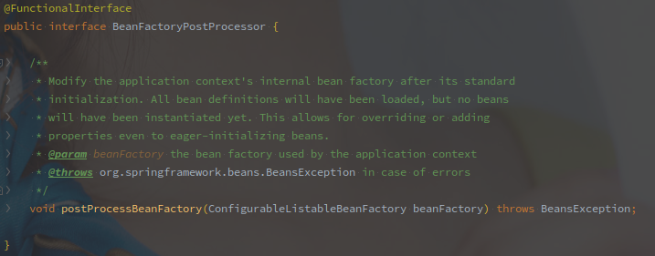
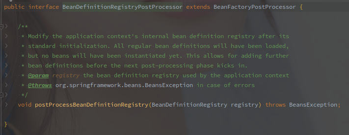

# BeanFactoryPostProcessor相关


- 本文以`refresh`的`invokeBeanFactoryPostProcessors(beanFactory)`作为切入点总结下`BeanFactoryPostProcessors`这个钩子的执行流程.

 

<!-- more -->

---

[TOC]


## 相关接口


### BeanFactoryPostProcessor

- BeanFactoryPostProcessor是SpringBoot中的扩展点之一,IOC容器级别钩子方法.
- **该接口可以在标准初始化之前,自定义修改BeanDefinition,但并不建议在里面对Bean进行初始化.**
- BeanFactoryPostProcessor在上下文刷新时被调用。

 


### BeanDefinitionRegistryPostProcessor

- 该接口是`BeanFactoryPostProcessor`的扩展.
- **实现该接口可以在标准初始化之前修改Bean的注册信息,比如额外多注册一些Bean之类.**

 


## PostProcessorRegistrationDelegate#invokeBeanFactoryPostProcessors

- 这里应该可以理解成一个委托吧,对BeanFactoryPostProcessors的调用是在PostProcessorRegistrationDelegate这个类中单独实现的.

```java
public static void invokeBeanFactoryPostProcessors(
			ConfigurableListableBeanFactory beanFactory, List<BeanFactoryPostProcessor> beanFactoryPostProcessors) {
		Set<String> processedBeans = new HashSet<>();
		// 判断BeanFactory是否实现BeanDefinitionRegistry
    	// 只有实现了BeanDefinitionRegistry,才能够调用BeanDefinitionRegistryPostProcessor的相关方法,增加或修改BeanDefinition
		if (beanFactory instanceof BeanDefinitionRegistry) {
                BeanDefinitionRegistry registry = (BeanDefinitionRegistry) beanFactory;
                List<BeanFactoryPostProcessor> regularPostProcessors = new ArrayList<>();
                List<BeanDefinitionRegistryPostProcessor> registryProcessors = new ArrayList<>();

                for (BeanFactoryPostProcessor postProcessor : beanFactoryPostProcessors) {
                        // 按照是否实现BeanDefinitionRegistryPostProcessor,将传入的分成两块
                        if (postProcessor instanceof BeanDefinitionRegistryPostProcessor) {
                            BeanDefinitionRegistryPostProcessor registryProcessor =
                                    (BeanDefinitionRegistryPostProcessor) postProcessor;
                            // 1. 这里是第一个执行的地方
                            // 传入的beanFactoryPostProcessors中的BeanDefinitionRegistryPostProcessor被执行调用
                            registryProcessor.postProcessBeanDefinitionRegistry(registry);
                            registryProcessors.add(registryProcessor);
                   		 } else {
                        	regularPostProcessors.add(postProcessor);
                        } 
				}
            
			// 之后就是执行已经注册的BeanDefinitionRegistryPostProcessor
            // PriorityOrdered -> Ordered -> Others

			List<BeanDefinitionRegistryPostProcessor> currentRegistryProcessors = new ArrayList<>();
			String[] postProcessorNames =
					beanFactory.getBeanNamesForType(BeanDefinitionRegistryPostProcessor.class, true, false);
			for (String ppName : postProcessorNames) {
				if (beanFactory.isTypeMatch(ppName, PriorityOrdered.class)) {
					currentRegistryProcessors.add(beanFactory.getBean(ppName, BeanDefinitionRegistryPostProcessor.class));
					processedBeans.add(ppName);
				}
			}
			sortPostProcessors(currentRegistryProcessors, beanFactory);
			registryProcessors.addAll(currentRegistryProcessors);
            // 2. 第二个执行的地方,执行继承了PriorityOrdered的
			invokeBeanDefinitionRegistryPostProcessors(currentRegistryProcessors, registry);
			currentRegistryProcessors.clear();

			// Next, invoke the BeanDefinitionRegistryPostProcessors that implement Ordered.
			postProcessorNames = beanFactory.getBeanNamesForType(BeanDefinitionRegistryPostProcessor.class, true, false);
			for (String ppName : postProcessorNames) {
				if (!processedBeans.contains(ppName) && beanFactory.isTypeMatch(ppName, Ordered.class)) {
					currentRegistryProcessors.add(beanFactory.getBean(ppName, BeanDefinitionRegistryPostProcessor.class));
					processedBeans.add(ppName);
				}
			}
			sortPostProcessors(currentRegistryProcessors, beanFactory);
			registryProcessors.addAll(currentRegistryProcessors);
            // 3. 第三个执行的地方,执行继承了Ordered的
			invokeBeanDefinitionRegistryPostProcessors(currentRegistryProcessors, registry);
			currentRegistryProcessors.clear();

			// Finally, invoke all other BeanDefinitionRegistryPostProcessors until no further ones appear.
			boolean reiterate = true;
			while (reiterate) {
                    reiterate = false;
                	// 这里会循环获取BeanDefinitionRegistryPostProcessor,直接BeanFactory中没有还未执行的
                    postProcessorNames = beanFactory.getBeanNamesForType(BeanDefinitionRegistryPostProcessor.class, true, false);
                    for (String ppName : postProcessorNames) {
                            if (!processedBeans.contains(ppName)) {
                                    currentRegistryProcessors.add(beanFactory.getBean(ppName, BeanDefinitionRegistryPostProcessor.class));
                                    processedBeans.add(ppName);
                                    reiterate = true;
                            }
                    }
                    sortPostProcessors(currentRegistryProcessors, beanFactory);
                    registryProcessors.addAll(currentRegistryProcessors);
                    // 4. 第四个执行的地方,执行其他的
                    invokeBeanDefinitionRegistryPostProcessors(currentRegistryProcessors, registry);
                    currentRegistryProcessors.clear();
			}

			// Now, invoke the postProcessBeanFactory callback of all processors handled so far.
			invokeBeanFactoryPostProcessors(registryProcessors, beanFactory);
			invokeBeanFactoryPostProcessors(regularPostProcessors, beanFactory);
		} else {
            // 如果BeanFactory没有继承registry
            // 直接执行入参中的BeanPostProcessor
			invokeBeanFactoryPostProcessors(beanFactoryPostProcessors, beanFactory);
		}

    	// 接下来是BeanFactory中已经注册的BeanPostProcessor的调用
    	// 还是按照PriorityOrdered -> Ordered -> Others的顺序
  		// 代码省略
		beanFactory.clearMetadataCache();
	}
```


## 重点BeanFactoryPostProcessor类

### ConfigurationClassPostProcessor

该类负责加载所有的`@Configuration`配置类.

具体源码分析待出炉.


## 总结

### BeanFactoryPostProcessor的执行顺序

1. 对入参判断,BeanFactory是否实现了BeanDefinitionRegistry接口,实现执行2,3,没有实现直接跳到4
2. 执行入参列表中的BeanDefinitionRegistryPostProcessor#postProcessBeanDefinitionRegistry
3. 执行BeanFactory中已经注册的BeanDefinitionRegistryPostProcessor#postProcessBeanDefinitionRegistry,已经注册的按照PriorityOrdered -> Ordered -> Others的顺序执行.
4. 执行入参列表中的BeanFactoryPostProcessor#postProcessBeanFactory
5. 执行BeanFactory中已经注册的BeanFactoryPostProcessor#postProcessBeanFactory,已经注册的按照PriorityOrdered -> Ordered -> Others的顺序执行.