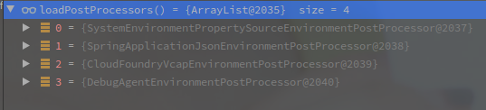
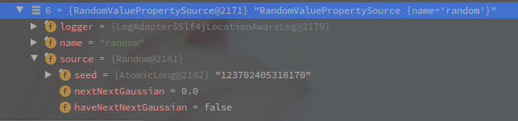
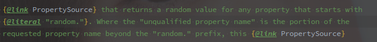
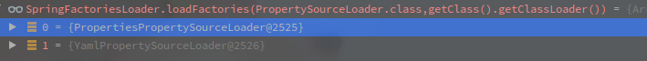

# ConfigFileApplicationListener

> ConfigFileApplicationListener就是SpringBoot启动过程中加载配置文件的监听器。

<!-- more -->

---

[TOC]


## 概述

该类会响应ApplicationEnvironmentPreparedEvent以及ApplicationPreparedEvent两个事件。

接下来主要是对ApplicationEnvironmentPreparedEvent事件的响应。

```java
// 响应的调度方法
// 根据事件的具体类型来决定触发逻辑。
@Override
public void onApplicationEvent(ApplicationEvent event) {
       if (event instanceof ApplicationEnvironmentPreparedEvent) {
           	// 对ApplicationEnvironmentPreparedEvent的响应方法
          	onApplicationEnvironmentPreparedEvent((ApplicationEnvironmentPreparedEvent) event);
       }
       if (event instanceof ApplicationPreparedEvent) {
          	onApplicationPreparedEvent(event);
       }
}
```


## #onApplicationEnvironmentPreparedEvent 

对ApplicationEnvironmentPreparedEvent的响应逻辑主要就是加载环境的一些东西。

```java
private void onApplicationEnvironmentPreparedEvent(ApplicationEnvironmentPreparedEvent event) {
        // 工厂模式获取所有的EnvironmentPostProcessor
        List<EnvironmentPostProcessor> postProcessors = loadPostProcessors();
        // ConfigFileApplicationListener也作为一个EnvironmentPostProcessor加入调用链
        postProcessors.add(this);
        // 按照Order排序
        AnnotationAwareOrderComparator.sort(postProcessors);
    	// 遍历执行
        for (EnvironmentPostProcessor postProcessor : postProcessors) {
            	postProcessor.postProcessEnvironment(event.getEnvironment(), event.getSpringApplication());
        }
}
```

该方法主要就是逻辑如下：

1. 通过工厂加载模式获取EnvironmentPostProcessor，加上监听器本身。
2. 按照Order排序后，遍历执行postProcessEnvironment方法。

可以看到Spring对环境的加载过程也可以借助EnvironmentPostProcessor来实现自定义的加载。

我猜Consul等的配置中心会不会就是通过的这种方式。


### #loadPostProcessors

```java
	List<EnvironmentPostProcessor> loadPostProcessors() {
		return SpringFactoriesLoader.loadFactories(EnvironmentPostProcessor.class, getClass().getClassLoader());
	}
```

该方法再简单不过了，就是通过工厂加载机制获取`EnvironmentPostProcessor`类的实现。

Debug时发现的`EnvironmentPostProcessor`有以下几个：

 

SystemEnvironmentPropertySourceEnvironmentPostProcessor是为了包装原有的系统属性。

SpringApplicationJsonEnvironmentPostProcessor看名字也知道是配置Json的。

其他的就先忽略.


### #postProcessEnvironment

ConfigFileApplicationListener本身也继承了EnvironmentPostProcessor，所以此时也会被调用。

```java
//  ConfigFileApplicationListener
@Override
public void postProcessEnvironment(ConfigurableEnvironment environment, SpringApplication application) {
    	addPropertySources(environment, application.getResourceLoader());
}

protected void addPropertySources(ConfigurableEnvironment environment, ResourceLoader resourceLoader) {
        // 此处添加了一个随机数 ,作用未知
        RandomValuePropertySource.addToEnvironment(environment);
        // 这里应该就是加载配置文件的过程了 
        new Loader(environment, resourceLoader).load();
}
```

看上去代码不多，点进去就是星辰大海。

简单来说该方法的主要作用如下:

1. 添加一个随机数到配置中`environment.propertySource`。
2. 加载本地配置文件

整个的配置环境加载逻辑不出意外就全在Loader内部类中了。


#### 随机数的作用

添加的随机数如下:

 

 

上面就是RandomValuePropertySource的类注释.

大意应该是下标超越random的属性都是非法的.


#### Loader类的初始化

```java
// ConfigFileApplicationListener@Loader
Loader(ConfigurableEnvironment environment, ResourceLoader resourceLoader) {
    // 配置了环境,占位符解析器,资源加载器,还有propertySourceLoader
    this.environment = environment;
    // 占位符处理
    this.placeholdersResolver = new PropertySourcesPlaceholdersResolver(this.environment);
    // 资源加载器
    this.resourceLoader = (resourceLoader != null) ? resourceLoader : new DefaultResourceLoader();
    // 工厂加载模式加载PropertySourceLoader
    this.propertySourceLoaders = SpringFactoriesLoader.loadFactories(PropertySourceLoader.class,
                                                                     getClass().getClassLoader());
}
```

Loader初始化的逻辑也不复杂，就是配置环境，占位符处理器，资源加载器，以及PropertySource的加载器。

占位符处理器会经过一个初始化流程，以下是PropertySourcesPlaceholdersResolver的构造函数

```java
// SystemPropertyUtils
public static final String PLACEHOLDER_PREFIX = "${";
public static final String PLACEHOLDER_SUFFIX = "}";
public static final String VALUE_SEPARATOR = ":";

// PropertySourcesPlaceholdersResolver
public PropertySourcesPlaceholdersResolver(Environment environment) {
    		this(getSources(environment), null);
}

// PropertySourcesPlaceholdersResolver
public PropertySourcesPlaceholdersResolver(Iterable<PropertySource<?>> sources, PropertyPlaceholderHelper helper){
            this.sources = sources;
            this.helper = (helper != null) 
                ? helper
            	: new PropertyPlaceholderHelper(SystemPropertyUtils.PLACEHOLDER_PREFIX,
                                                                            SystemPropertyUtils.PLACEHOLDER_SUFFIX, SystemPropertyUtils.VALUE_SEPARATOR, true);
}
```

**可以看到这边默认的前后符号以及分隔符号 "${"， "}"， ":"，这是我们使用PropertySource的常规表达**

另外PropertySource的配置就是通过工厂模式获取到的两个PropertySourceLoader，具体如下：

 

分别对应了Properties和Yaml两种格式的PropertySource加载逻辑。

此时Loader初始化完毕，其中制定了资源加载器，占位符，以及两个不同类型的资源加载器，分别负责不同类型的文件配置加载。

再然后就是整个配置文件加载过程了，方法调用链有点长而且好多load重载方法.


#### #load

```java
// ConfigFileApplicationListener
private static final String DEFAULT_PROPERTIES = "defaultProperties";
private static final Set<String> LOAD_FILTERED_PROPERTY;
static {
        Set<String> filteredProperties = new HashSet<>();
        filteredProperties.add("spring.profiles.active");
        filteredProperties.add("spring.profiles.include");
        LOAD_FILTERED_PROPERTY = Collections.unmodifiableSet(filteredProperties);
}

// ConfigFileApplicationListener#load
void load() {
    FilteredPropertySource.apply(this.environment, DEFAULT_PROPERTIES, LOAD_FILTERED_PROPERTY,
                                 (defaultProperties) -> {
                                     this.profiles = new LinkedList<>();
                                     this.processedProfiles = new LinkedList<>();
                                     this.activatedProfiles = false;
                                     this.loaded = new LinkedHashMap<>();
                                     // 初始化profiles
                                     initializeProfiles();
                                     while (!this.profiles.isEmpty()) {
                                         Profile profile = this.profiles.poll();
                                         if (isDefaultProfile(profile)) {
                                             addProfileToEnvironment(profile.getName());
                                         }
                                         load(profile, this::getPositiveProfileFilter,
                                              addToLoaded(MutablePropertySources::addLast, false));
                                         this.processedProfiles.add(profile);
                                     }
                                     load(null, this::getNegativeProfileFilter, addToLoaded(MutablePropertySources::addFirst, true));
                                     addLoadedPropertySources();
                                     applyActiveProfiles(defaultProperties);
                                 });
}


// FilteredPropertySource#apply
// propertySourceName  ==>  defaultProperties
// filteredProperties  ==>  spring.profiles.active ＆spring.profiles.include
static void apply(ConfigurableEnvironment environment, String propertySourceName, Set<String> filteredProperties,
			Consumer<PropertySource<?>> operation) {
		MutablePropertySources propertySources = environment.getPropertySources();
		PropertySource<?> original = propertySources.get(propertySourceName);
		if (original == null) {
            // accept回跳到上面的内部类
			operation.accept(null);
			return;
		}
		propertySources.replace(propertySourceName, new FilteredPropertySource(original, filteredProperties));
		try {
			operation.accept(original);
		}
		finally {
			propertySources.replace(propertySourceName, original);
		}
	}
```


#### ConfigFileApplicationListener#initializeProfiles

```java

 public static final String ACTIVE_PROFILES_PROPERTY = "spring.profiles.active";
public static final String INCLUDE_PROFILES_PROPERTY = "spring.profiles.include";

// ConfigFileApplicationListener#initializeProfiles
private void initializeProfiles() {
    // The default profile for these purposes is represented as null. We add it
    // first so that it is processed first and has lowest priority.
    this.profiles.add(null);
    Set<Profile> activatedViaProperty = getProfilesFromPxmlroperty(ACTIVE_PROFILES_PROPERTY);
    Set<Profile> includedViaProperty = getProfilesFromProperty(INCLUDE_PROFILES_PROPERTY);
    List<Profile> otherActiveProfiles = getOtherActiveProfiles(activatedViaProperty, includedViaProperty);
    this.profiles.addAll(otherActiveProfiles);
    // Any pre-existing active profiles set via property sources (e.g.
    // System properties) take precedence over those added in config files.
    this.profiles.addAll(includedViaProperty);
    addActiveProfiles(activatedViaProperty);
    if (this.profiles.size() == 1) { // only has null profile
        for (String defaultProfileName : this.environment.getDefaultProfiles()) {
            Profile defaultProfile = new Profile(defaultProfileName, true);
            this.profiles.add(defaultProfile);
        }
    }
}

// ConfigFileApplicationListener#getProfilesFromProperty
private Set<Profile> getProfilesFromProperty(String profilesProperty) {
    if (!this.environment.containsProperty(profilesProperty)) {
        return Collections.emptySet();
    }
    Binder binder = Binder.get(this.environment);
    Set<Profile> profiles = getProfiles(binder, profilesProperty);
    return new LinkedHashSet<>(profiles);
}
```


#### ConfigFileApplicationListener#load

```java
// ConfigFileApplicationListener#load
private void load(Profile profile, DocumentFilterFactory filterFactory, DocumentConsumer consumer) {
    // 获取地址并遍历执行
    getSearchLocations().forEach((location) -> {
        boolean isFolder = location.endsWith("/");
        Set<String> names = isFolder ? getSearchNames() : NO_SEARCH_NAMES;
        names.forEach((name) -> load(location, name, profile, filterFactory, consumer));
    });
}

// 可配置的配置文件地址,如果配置该属性,默认的文件地址失效
public static final String CONFIG_LOCATION_PROPERTY = "spring.config.location";
// 附加的配置文件地址
public static final String CONFIG_ADDITIONAL_LOCATION_PROPERTY = "spring.config.additional-location";
// 默认的配置文件地址
private static final String DEFAULT_SEARCH_LOCATIONS = "classpath:/,classpath:/config/,file:./,file:./config/";

// ConfigFileApplicationListener#getSearchLocations
// 该方法用于获取需要搜索的本地配置文件地址
// 默认就是上面的四个文件地址,逗号分割
private Set<String> getSearchLocations() {
    // 如果指定了spring.config.location,那么后面的就失效了
    if (this.environment.containsProperty(CONFIG_LOCATION_PROPERTY)) {
        return getSearchLocations(CONFIG_LOCATION_PROPERTY);
    }
    // 本地的附加配置文件地址
    Set<String> locations = getSearchLocations(CONFIG_ADDITIONAL_LOCATION_PROPERTY);
    locations.addAll(
        asResolvedSet(ConfigFileApplicationListener.this.searchLocations, DEFAULT_SEARCH_LOCATIONS));
    return locations;
}

// ConfigFileApplicationListener#asResolvedSet
// 分割并返回,对配置文件地址和名称都会进行分割
private Set<String> asResolvedSet(String value, String fallback) {
    List<String> list = Arrays.asList(StringUtils.trimArrayElements(StringUtils.commaDelimitedListToStringArray(
        (value != null) ? this.environment.resolvePlaceholders(value) : fallback)));
    // 这个翻转一下什么意思
    Collections.reverse(list);
    // 去重返回
    return new LinkedHashSet<>(list);
}

// 默认的配置文件名称
private static final String DEFAULT_NAMES = "application";
// 配置项 - 配置文件名称,如果配置该属性,默认的文件名称失效
// 应该是可以以","分割
public static final String CONFIG_NAME_PROPERTY = "spring.config.name";

// ConfigFileApplicationListener#getSearchNames
// 获取配置文件的名称
private Set<String> getSearchNames() {
    if (this.environment.containsProperty(CONFIG_NAME_PROPERTY)) {
        String property = this.environment.getProperty(CONFIG_NAME_PROPERTY);
        return asResolvedSet(property, null);
    }
    return asResolvedSet(ConfigFileApplicationListener.this.names, DEFAULT_NAMES);
}

// ConfigFileApplicationListener#load
private void load(String location, String name, Profile profile, DocumentFilterFactory filterFactory,
                  DocumentConsumer consumer) {
    if (!StringUtils.hasText(name)) {
        for (PropertySourceLoader loader : this.propertySourceLoaders) {
            if (canLoadFileExtension(loader, location)) {
                load(loader, location, profile, filterFactory.getDocumentFilter(profile), consumer);
                return;
            }
        }
        throw new IllegalStateException("File extension of config file location '" + location
                                        + "' is not known to any PropertySourceLoader. If the location is meant to reference "
                                        + "a directory, it must end in '/'");
    }
    Set<String> processed = new HashSet<>();
    // 这里是策略模式,不同的扩展名和加载方式
    for (PropertySourshiyongceLoader loader : this.propertySourceLoaders) {
        for (String fileExtension : loader.getFileExtensions()) {
            if (processed.add(fileExtension)) {
                loadForFileExtension(loader, location + name, "." + fileExtension, profile, filterFactory,
                                     consumer);
            }
        }
    }
}
```

- 这个调用链真的太长了..还都是load方法 我选择放弃,有空再来吧

其他的监听器也以后再说吧。

## 小结

ConfigFileApplicationListener会被ApplicationEnvironmentPreparedEvent触发,开始加载配置文件.

配置文件默认在`classpath:/,classpath:/config/,file:./,file:./config/`四个地址中,且默认文件名为`application`

可以使用`spring.config.additional-location`增加配置地址,也可以直接用`spring.config.location`直接覆盖默认.

`spring.config.name`也可以直接用来覆盖默认的配置文件名.

SpringBoot以`PropertySourceLoader`加载Property类属性,默认的实现有`PropertiesPropertySourceLoader`和`YamlPropertySourceLoader`,此处用了策略模式.

`YamlPropertySourceLoader`可以解析后缀名为`yml`以及`yaml`.

`PropertiesPropertySourceLoader`可以解析`properties`以及`xml`.