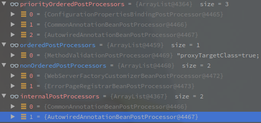

## SpringBoot源码计划

因为SpringBoot的代码真的太复杂了,为了尽快理清整个流程,有些过程会暂时简写带过.

下面就是计划列表,以后打算要看的

1. ConfigurationClassPostProcessor类的执行
2. obtainFreshBeanFactory的什么时候会执行刷新逻辑
3. prepareBeanFactory中注册的ApplicationListenerDetector
4. BeanPostProcess的执行逻辑

 

