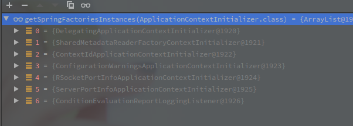
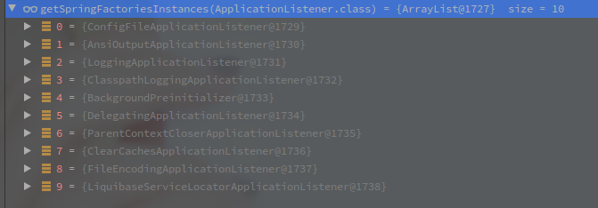
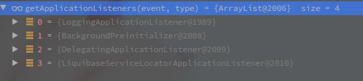

# SpringBoot的启动流程概述

- 尽量不会有太多的代码，以理清楚流程为主，复杂的代码会单独一个文件。
- 以SpringBoot Servlet Web应用为基础分析.

---

<!-- more -->

[TOC]


## 外层调用链子

```java
@SpringBootApplication
public class MvcApplication {
        public static void main(String[] args) {
            	SpringApplication.run(MvcApplication.class, args);
        }
}
```

以上是最基础的Spring应用启动代码，调用SpringApplication的静态方法run启动Spring的整个容器。


## SpringApplication构造函数

```java
// SpringApplication
// 入参中的的PrimarySources是配置主类,也就是MvcApplication.class.
public SpringApplication(ResourceLoader resourceLoader, Class<?>... primarySources) {
            // 资源加载器,此处为null
            this.resourceLoader = resourceLoader;
            Assert.notNull(primarySources, "PrimarySources must not be null");
             // 主要数据源集合
            this.primarySources = new LinkedHashSet<>(Arrays.asList(primarySources));
             // Web应用类型
            this.webApplicationType = WebApplicationType.deduceFromClasspath();
             // 设置初始化器,具体有哪些看下文
             setInitializers(
                (Collection)getSpringFactoriesInstances(ApplicationContextInitializer.class));
              // 设置监听者
            setListeners((Collection) getSpringFactoriesInstances(ApplicationListener.class));
              // 推断应用主类，此处代码我感觉还是很新奇的
            this.mainApplicationClass = deduceMainApplicationClass();
}
```

### 初始化器

ApplicationContextInitializer的实现子类:

 

ServerPortInfoApplicationContextInitializer 会直接添加一个WebServerInitializedEvent的监听

其他的留坑。

### 监听器

 

其中最为关键的应该就是ConfigFileApplicationListener,会响应ApplicationEnvironmentPreparedEvent和ApplicationPreparedEvent事件,加载各类配置文件.

### 推断主类

mainApplicationClass的推断过程很有意思，直接构造一个RuntimeException然后遍历异常的堆栈信息查找main方法，获取当前主类。

```java
...
    try {
        StackTraceElement[] stackTrace = new RuntimeException().getStackTrace();
        for (StackTraceElement stackTraceElement : stackTrace) {
            if ("main".equals(stackTraceElement.getMethodName())) {
                return Class.forName(stackTraceElement.getClassName());
            }
        }
 ...
```


---

## Run()方法

- run方法是启动的核心方法，包含了环境准备，监听事件的发布，上下文的刷新及后续处理等等。
- 执行方法的结果就是返回一个可使用的ConfigurationApplicationContext,也可以理解为就是应用上下文的装配过程.

```java
	public ConfigurableApplicationContext run(String... args) {
        // 用于记录时间，可以当做是秒表
		StopWatch stopWatch = new StopWatch();
		stopWatch.start();
        // 这个就是最终要返回的上下文对象 
        ConfigurableApplicationContext context = null;
        // 异常报告
		Collection<SpringBootExceptionReporter> exceptionReporters = new ArrayList<>();
        // Headless相关配置
		configureHeadlessProperty();
        // 工厂加载机制获取SpringApplicationRunListener，并封装为一个对象
        // SpringApplicationRunListener是应用启动前期的广播器.
		SpringApplicationRunListeners listeners = getRunListeners(args)；
         // 触发ApplicationStartingEvent
		listeners.starting();
		try {
                // 对main方法的入参进行包装
                ApplicationArguments applicationArguments = new DefaultApplicationArguments(args);
                // 准备容器环境
                // 会触发ApplicationEnvironmentPreparedEvent，读取配置文件中的内容
                // 会将环境与当前的SpringApplication绑定
                ConfigurableEnvironment environment = prepareEnvironment(listeners, applicationArguments);
                // 配置忽略的Bean信息,`spring.beaninfo.ignore`配置项
                configureIgnoreBeanInfo(environment);
                // 输出Banner
                Banner printedBanner = printBanner(environment);
                // 创建对应的应用上下文
                // 当前环境的上下文主类是AnnotationConfigServletWebServerApplicationContext
                context = createApplicationContext();
                // 还是工厂加载模式，获取异常的报告之类的
                exceptionReporters = getSpringFactoriesInstances(SpringBootExceptionReporter.class,
                        new Class[] { ConfigurableApplicationContext.class }, context);
                // 准备上下文 
                prepareContext(context, environment, listeners, applicationArguments, printedBanner);
                // 刷新上下文
                refreshContext(context);
                // 刷新上下文之后的操作
                // Servlet Web环境下并没有实现该方法
                afterRefresh(context, applicationArguments);
                // 计时结束
                stopWatch.stop();
                if (this.logStartupInfo) {
                        new StartupInfoLogger(this.mainApplicationClass).logStarted(getApplicationLog(), stopWatch);
                }
                // 广播ApplicationStartedEvent
                listeners.started(context);
                callRunners(context, applicationArguments);
		} catch (Throwable ex) {
                handleRunFailure(context, ex, exceptionReporters, listeners);
                throw new IllegalStateException(ex);
		}

		try {
				listeners.running(context);
		} catch (Throwable ex) {
                handleRunFailure(context, ex, exceptionReporters, null);
                throw new IllegalStateException(ex);
		}
		return context;
	}
```


### 1. 配置Headless

```java
private static final String SYSTEM_PROPERTY_JAVA_AWT_HEADLESS = "java.awt.headless";

private void configureHeadlessProperty() {
    	// System的相关配置 
		System.setProperty(SYSTEM_PROPERTY_JAVA_AWT_HEADLESS,
				System.getProperty(SYSTEM_PROPERTY_JAVA_AWT_HEADLESS, Boolean.toString(this.headless)));
}
```

Headless模式是应用的一种配置模式。

在服务器可能缺少显示设备、键盘、鼠标等外设的情况下可以使用这种模式。


### 2. 获取并启动监听器

```java
// SpringApplication
SpringApplicationRunListeners listeners = getRunListeners(args)；
      
private SpringApplicationRunListeners getRunListeners(String[] args) {
    Class<?>[] types = new Class<?>[] { SpringApplication.class, String[].class };
    return new SpringApplicationRunListeners(logger,
                                             getSpringFactoriesInstances(SpringApplicationRunListener.class, types, this, args));
}
```

**Spring中的事件发布一般是通过`ApplicationContext`实现,但是此时并没有准备好应用上下文,所以会以`SpringApplicationRunListeners`这个工具类的形式发布.**

`SpringApplicationRunListeners`内部封装了Log对象和`SpringApplicationRunListener`（前面的有个s）的集合.

而`SpringApplicationRunListener`是对启动过程中事件发布的规范接口，定义了各种相关事件，一个抽象方法对应一个事件类型。

其默认的实现只有`EventPublishingRunListener`.

```java
// EventPublishingRunListener的构造函数
public EventPublishingRunListener(SpringApplication application, String[] args) {
        this.application = application;
        this.args = args;
        this.initialMulticaster = new SimpleApplicationEventMulticaster();
        for (ApplicationListener<?> listener : application.getListeners()) {
            	this.initialMulticaster.addApplicationListener(listener);
        }
}
```

从构造函数也可以看出,`EventPublishingRunListener`就是对广播器的一个封装,事件广播最终还是会通过`SimpleApplicationEventMulticaster`.

详细的可以看[Spring的事件模型](./Spring的事件模型.md#SpringBoot启动过程中的事件)


### 3. 发布ApplicationStartingEvent

该事件涉及的监听器有以下四个:

 

具体作用先忽略.


### 4. 创建并准备环境容器

创建环境容器,并加载

[SpringBoot启动过程中的环境准备](./SpringBoot启动过程中的环境准备.md)


## 创建应用上下文

逻辑很简单，根据不同的Web应用类型创建对应的上下文类

- Default - `AnnotationConfigApplicationContext`
- Servlet - `AnnotationConfigServletWebServerApplicationContext`
- Reactive - `AnnotationConfigReactiveWebServerApplicationContext`


## 准备上下文

- 应用`ApplicationContextInitializer`
- 上下文准备完成事件
- 注册特定的一些单例Bean对象（包‘括banner）
- 加载应用上下文
- 上下文加载完成事件

```java
	private void prepareContext(ConfigurableApplicationContext context, ConfigurableEnvironment environment,
			SpringApplicationRunListeners listeners, ApplicationArguments applicationArguments, Banner printedBanner) {
        // 设置环境
        // 不仅仅配置到上下文，也会配置到上下文中的BeanDefinitionReader和Scanner
		context.setEnvironment(environment);
		postProcessApplicationContext(context);
        // 应用所有的ApplicationContextInitializer类
        // 此时的类都是在Application的构造函数中通过工厂加载机制获取的
		applyInitializers(context);
        // 发布ApplicationContextInitializedEvent
		listeners.contextPrepared(context);
		if (this.logStartupInfo) {
			logStartupInfo(context.getParent() == null);
			logStartupProfileInfo(context);
		}
		// 塞几个特定的bean
        // spring的启动参数bean
		ConfigurableListableBeanFactory beanFactory = context.getBeanFactory();
        // 命令行参数的Bean
		beanFactory.registerSingleton("springApplicationArguments", applicationArguments);
		if (printedBanner != null) {
             // banner为啥也要塞进来。。。。
			beanFactory.registerSingleton("springBootBanner", printedBanner);
		}
        // 设置是否允许bean对象的覆盖
        // 默认是false
		if (beanFactory instanceof DefaultListableBeanFactory) {
			((DefaultListableBeanFactory) beanFactory)
					.setAllowBeanDefinitionOverriding(this.allowBeanDefinitionOverriding);
		}
		if (this.lazyInitialization) {
			context.addBeanFactoryPostProcessor(new LazyInitializationBeanFactoryPostProcessor());
		}
		// 获取所有的配-置，包含SpringApplication中的sources和primarySources
		Set<Object> sources = getAllSources();
		Assert.notEmpty(sources, "Sources must not be empty");
		load(context, sources.toArray(new Object[0]));
         // 发布ApplicationPreparedEvent
		listeners.contextLoaded(context);
	}

```

# 

## 1.ApplicationContextInitializer  -  引用上下文初始化

```java
public interface ApplicationContextInitializer<C extends ConfigurableApplicationContext> {
	/**
	 * Initialize the given application context.
	 * @param applicationContext the application to configure
	 */
	void initialize(C applicationContext);
}
```

在refresh方法之前会调用的回调方法。

以`ConfigurableApplicationContext`为入参，可以对其进行修改。

可以使用`@Order`或者Ordered接口进行排序。

