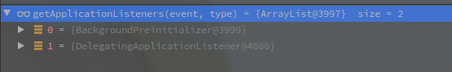

# SpringBoot启动过程中的上下文准备


---

[TOC]


## 主方法逻辑

```java
	private void prepareContext(ConfigurableApplicationContext context, ConfigurableEnvironment environment,
			SpringApplicationRunListeners listeners, ApplicationArguments applicationArguments, Banner printedBanner) {
        // 填充环境到应用上下文
		context.setEnvironment(environment);
        // 应用上下文的后续处理,具体可看下文
		postProcessApplicationContext(context);
        // 应用全部的初始化器
		applyInitializers(context);
        // 发布ApplicationContextInitializedEvent
		listeners.contextPrepared(context);
		if (this.logStartupInfo) {
			logStartupInfo(context.getParent() == null);
			logStartupProfileInfo(context);
		}
		// 获取beanFactory对象
		ConfigurableListableBeanFactory beanFactory = context.getBeanFactory();
        // 将args的包装对象注册为单例
		beanFactory.registerSingleton("springApplicationArguments", applicationArguments);
        // 将Banner也注册了
		if (printedBanner != null) {
			beanFactory.registerSingleton("springBootBanner", printedBanner);
		}
        // 判断如果是DefaultListableBeanFactory类
		if (beanFactory instanceof DefaultListableBeanFactory) {
            // 设置BeanDefinition是否可覆盖
			((DefaultListableBeanFactory) beanFactory)
            		// allowBeanDefinitionOverriding在环境准备的bind()方法中修改
            		// 通过调用链得知,具体省略
					.setAllowBeanDefinitionOverriding(this.allowBeanDefinitionOverriding);
		}
        // 如果是懒加载增加一个BeanFactoryPostProcessor
		if (this.lazyInitialization) {
			context.addBeanFactoryPostProcessor(new LazyInitializationBeanFactoryPostProcessor());
		}
		// Load the sources
		Set<Object> sources = getAllSources();
		Assert.notEmpty(sources, "Sources must not be empty");
        // 加载BeanDefinitionLoader
		load(context, sources.toArray(new Object[0]));
		listeners.contextLoaded(context);
	}
```


## 应用上下文的后处理

具体逻辑不复杂,注册了beanNameGenerator,配置上下文和BeanFactory的工具类.

```java
public static final String CONFIGURATION_BEAN_NAME_GENERATOR =
			"org.springframework.context.annotation.internalConfigurationBeanNameGenerator";

// SpringApplication	
protected void postProcessApplicationContext(ConfigurableApplicationContext context) {
    	// 注册BeanNameGenerator为单例Bean 
        if (this.beanNameGenerator != null) {
            context.getBeanFactory().registerSingleton(AnnotationConfigUtils.CONFIGURATION_BEAN_NAME_GENERATOR,
                                                       this.beanNameGenerator);
        }
    	// 配置资源加载器
        if (this.resourceLoader != null) {
            if (context instanceof GenericApplicationContext) {
                ((GenericApplicationContext) context).setResourceLoader(this.resourceLoader);
            }
            if (context instanceof DefaultResourceLoader) {
                ((DefaultResourceLoader) context).setClassLoader(this.resourceLoader.getClassLoader());
            }
        }
    	// 填充转换类到BeanFactory
        if (t	protected void applyInitializers(ConfigurableApplicationContext context) {
		for (ApplicationContextInitializer initializer : getInitializers()) {
			Class<?> requiredType = GenericTypeResolver.resolveTypeArgument(initializer.getClass(),
					ApplicationContextInitializer.class);
			Assert.isInstanceOf(requiredType, context, "Unable to call initializer.");
			initializer.initialize(context);
		}
	}
```


## 应用初始化器

此方法内调用在构造函数中填充的全部初始化器的`initialize`方法.

```java
// SpringApplication
protected void applyInitializers(ConfigurableApplicationContext context) {
         // 遍历调用
        for (ApplicationContextInitializer initializer : getInitializers()) {
            // 判断类型
            Class<?> requiredType = GenericTypeResolver.resolveTypeArgument(initializer.getClass(),
                                                                            ApplicationContextInitializer.class);
            Assert.isInstanceOf(requiredType, context, "Unable to call initializer.");
    		// 调用
            initializer.initialize(context);
        }
}
// 就是将一开始构造函数中获取的初始化器全部提取并排序
public Set<ApplicationContextInitializer<?>> getInitializers() {
   	 	return asUnmodifiableOrderedSet(this.initializers);
}
```


## 发布ApplicationContextInitializedEvent

以下为具体的监听者

 

功能先忽略.


## load

主要负责创建BeanDefinitionLoader,填充必要属性并BeanDefinition.

```java
protected void load(ApplicationContext context, Object[] sources) {
            if (logger.isDebugEnabled()) {
                logger.debug("Loading source " + StringUtils.arrayToCommaDelimitedString(sources));
            }
    		// 创建BeanDefinitionLoader类,负责加载BeanDefinition
            BeanDefinitionLoader loader = createBeanDefinitionLoader(getBeanDefinitionRegistry(context), sources);
    		// 为BeanDefinitionLoader填充属性
            if (this.beanNameGenerator != null) {
                loader.setBeanNameGenerator(this.beanNameGenerator);
            }
            if (this.resourceLoader != null) {
                loader.setResourceLoader(this.resourceLoader);
            }
            if (this.environment != null) {
                loader.setEnvironment(this.environment);
            }
    		// 加载BeanDefinitionLoader
            loader.load();
}

```

具体细节先忽略.